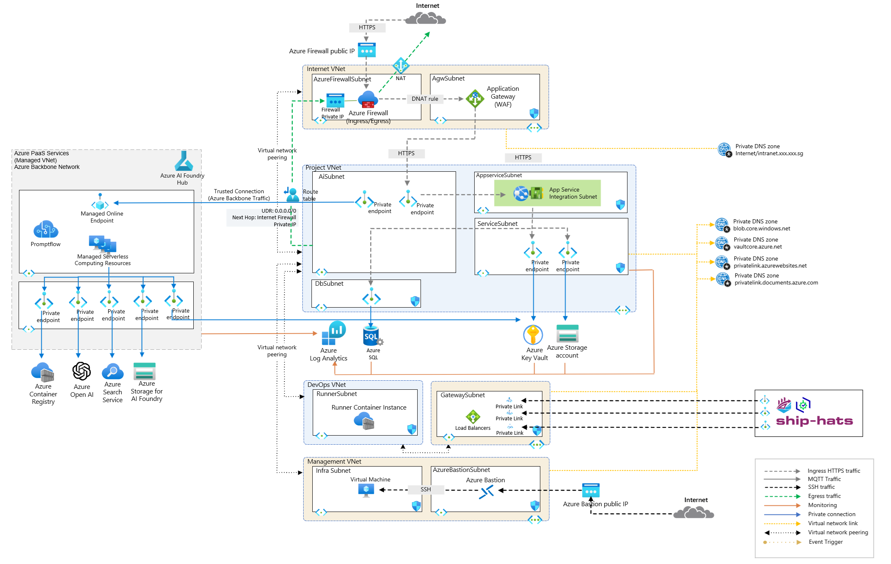

# AI Foundry Archetype Setup - Deployment Overview

This repository provides the configuration and infrastructure for an Azure AI Foundry archetype with enterprise-grade features, ensuring high availability, security, and scalability. The setup integrates with Microsoft Entra ID for authentication and authorization, supporting both internet and intranet workloads with isolated networking configurations.

---

## **Architecture Overview**

### **Components**

1. **AI Foundry Hub**  
   - A centralized platform for developing, training, and deploying AI and machine learning models at scale.  
   - Integrates seamlessly with Azure Machine Learning, enabling collaboration, experiment tracking, and model versioning.  
   - Provides prebuilt AI services for common scenarios, such as natural language processing and computer vision.  

2. **App Service**  
   - A managed platform for building, deploying, and scaling web apps, APIs, and backend services.  
   - Provides support for various programming languages and frameworks with built-in CI/CD capabilities.  
   - Offers advanced features like custom domains, SSL certificates, and hybrid connectivity through VNet integration.  

3. **Azure Container Registry (ACR)**  
   - A private Docker registry for securely storing and managing container images.  
   - Supports integration with Azure Kubernetes Service (AKS) and other Azure services for containerized deployments.  
   - Provides image scanning, geo-replication, and authentication with Azure Active Directory.  

4. **Virtual Network**  
   - Provides secure and isolated networking for Azure resources, enabling them to communicate privately.  
   - Supports features like subnetting, NSGs (Network Security Groups), and VPN/ExpressRoute connectivity for hybrid setups.  

5. **Ingress Controller**  
   - Acts as a load balancer and routes external HTTP(S) traffic to Kubernetes services or microservices within the cluster.  
   - Supports SSL termination, URL path-based routing, and other advanced traffic management features.  

6. **Azure Key Vault**  
    - Securely stores sensitive information like passwords, API keys, and certificates to enhance application security.  
    - Supports integration with Azure services for seamless secrets and key management.  

7. **Azure SQL Server**  
    - A highly available and scalable relational database service with built-in automated backups, monitoring, and recovery.  
    - Provides robust features for security and performance optimization, including TDE (Transparent Data Encryption) and query performance insights.  

8. **Azure Storage Account**  
    - A versatile storage service offering Blob, File, Queue, and Table storage for a wide range of use cases.  
    - Ensures data redundancy and high availability with replication options like LRS (Locally Redundant Storage) and GRS (Geo-Redundant Storage).  
9. **Azure Monitor**  
    - Centralized monitoring service for gathering metrics, logs, and traces from Azure resources and applications.  
    - Offers advanced alerting, visualization, and integration with tools like Log Analytics and Application Insights.  

10. **DevOps Integration**  
    - Facilitates automated deployments and continuous delivery using Azure DevOps Pipelines or GitHub Actions.  
    - Ensures consistent workflows with infrastructure as code (IaC) practices using tools like Terraform or Bicep.  

--- 

## Key Features  

### **Integrated AI Foundry Hub**  
- A comprehensive platform for building, deploying, and operationalizing AI solutions across various use cases.  
- Enables seamless collaboration between data scientists, developers, and business stakeholders with tools for experiment tracking, model versioning, and deployment management.  
- Offers prebuilt AI services, such as natural language processing and image recognition, along with support for custom models built in Azure Machine Learning.  

### **Security and Compliance**  
- Offers advanced network isolation, role-based access control (RBAC), and integration with Azure Key Vault to securely manage sensitive information.  

### **Scalability and Performance**  
- Engineered to support large-scale AKS microservices workloads with high performance, ensuring readiness for future growth.  

### **Operational Efficiency**  
- Simplifies deployment with predefined configurations and seamless integration with Azure services to optimize operations.  

### **Networking and Identity Management**  
- Facilitates efficient access control through streamlined deployment of networking and identity resources.  

### **Azure Service Integration**  
- Provides seamless compatibility with Azure services such as Azure Container Registry, Azure SQL Server, and Azure Storage Account, enhancing functionality and operational synergy.  

### **Modular Deployment**  
- Enables selective deployment of solution layers based on specific requirements, while considering interdependencies:  
  - Full deployment ensures an end-to-end solution incorporating best practices like network isolation, managed identities, and RBAC.  
  - Flexible configuration allows the exclusion of certain layers, such as the networking layer and individual Azure resources, with options to customize the module as needed.  
  - Supports deployment into existing Virtual Networks (VNETs) for seamless integration with Azure Landing Zones, enhancing adaptability to established infrastructures.  

---

## **Requirements**

- **Terraform Version**: `>= 1.3.4`
- **AzureRM Provider**: `4.11.0` or later
- **AzAPI Provider**: `Azure/azapi`

This solution accelerator can be deployed standalone or integrated into an Azure Landing Zone strategy, offering a flexible and secure foundation for an AKS Cluster on Azure.

