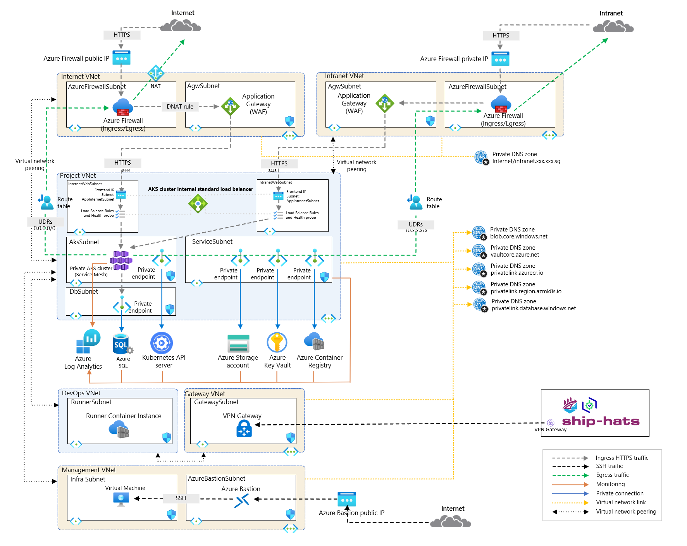

# AKS Cluster Setup - Deployment Overview

This repository provides the configuration and infrastructure for an AKS archetype with enterprise-grade features, ensuring high availability, security, and scalability. The setup integrates with Microsoft Entra ID for authentication and authorization, supporting both internet and intranet workloads with isolated networking configurations.

---

## **Architecture Overview**

### **Components**

1. **AKS Private Cluster**
   - A managed Kubernetes service for running containerized microservices.
   - Ensures private access through Azure virtual networks.

2. **Virtual Network**
   - Provides network isolation and secure communication between microservices.

3. **Ingress Controller**
   - Routes external traffic to the appropriate microservices within the cluster.

4. **Azure Load Balancer**
   - Distributes traffic evenly across AKS nodes for scalability and resilience.

5. **Azure Container Registry (ACR)**
   - A private Docker registry for securely storing and managing container images.

6. **Azure Key Vault**
   - Securely stores and manages cryptographic keys, secrets, and certificates, enhancing application security.

7. **Azure SQL Server**
   - A fully managed SQL database service with built-in high availability and disaster recovery.

8. **Azure Storage Account**
   - Provides scalable, secure, and durable cloud storage for blobs, files, queues, and tables.

9. **Azure Monitor**
   - Collects and visualizes metrics, logs, and traces for monitoring and troubleshooting.

10. **DevOps Integration**
    - Streamlines deployment with CI/CD pipelines using Azure DevOps or GitHub Actions.

---

## Key Features
### Integrated Private AKS Cluster: 
- The Private AKS Cluster is a core component of Azure AKS that centralizes project management, enabling collaborative development and efficient resource allocation of microservices design.
- #### **Private Cluster**
   - The AKS cluster is deployed as a private cluster, restricting API server access to authorized private endpoints only, enhancing security.

- #### **Authentication and Authorization**
   - **Microsoft Entra ID Authentication**: Integrates with Microsoft Entra ID for user authentication.
   - **Kubernetes RBAC**: Enforces role-based access control (RBAC) for fine-grained access control.

- #### **Node Pools**
   - **Max Pods per Node**: Supports up to 250 pods per node for high-density pod usage.
   - **Autoscaling**: Automatically adjusts the number of nodes based on resource demands for cost-efficiency.
   - **System Node Pool**: Reserved for system workloads.
   - **User Node Pools**:
     - **Internet Node Pool**:
       - Namespace: `internet`
       - Node Pool: `poolappsinternet`
       - Private IP Listener: Configured in `UserNodePoolInternetSubnet` or `WebInternetSubnet`.
       - Node Labels: `agentnodepool=poolappsinternet`
     - **Intranet Node Pool**:
       - Namespace: `intranet`
       - Node Pool: `poolappsintranet`
       - Private IP Listener: Configured in `UserNodePoolIntranetSubnet` or `WebIntranetSubnet`.
       - Node Labels: `agentnodepool=poolappsintranet`

- #### **Service Mesh - Istio**
   - The Istio service mesh is used for traffic management, observability, security, and policy enforcement.

- #### **Container Insights**
   - Azure Monitor’s Container Insights provides monitoring, logging, and alerting for cluster and container-level metrics.

- #### **Network Configuration**
   - **Azure CNI Overlay**: Supports scalable pod-to-pod and pod-to-service networking with efficient IP address management.
   - **Network Policy**: Uses Calico for secure pod communication.
   - **Load Balancer**: Utilizes a Standard SKU load balancer.

- #### **Encryption**
   - **At-rest Encryption**: All data is encrypted at rest using Azure's platform-managed encryption keys for robust data protection.

- #### **Diagnostic Settings**
   - Configured to capture logs and metrics for comprehensive monitoring and troubleshooting.

- #### **Defender for Cloud**
   - Secures the cluster with Microsoft Defender for Containers, offering advanced features such as vulnerability assessments, runtime protection, and threat detection.

- #### **Secrets Management**
   - Integrates Azure Key Vault with AKS using the CSI driver for secure secrets management.

### **Security and Compliance**
- Offers advanced network isolation, role-based access control (RBAC), and integration with Azure Key Vault to securely manage sensitive information.

### **Scalability and Performance**
- Engineered to support large-scale AKS microservices workloads with high performance, ensuring readiness for future growth.

### **Operational Efficiency**
- Simplifies deployment with predefined configurations and seamless integration with Azure services to optimize operations.

### **Networking and Identity Management**
- Facilitates efficient access control through streamlined deployment of networking and identity resources.

### **Azure Service Integration**
- Provides seamless compatibility with Azure services such as Azure Container Registry, Azure SQL Server, and Azure Storage Account, enhancing functionality and operational synergy.

### **Modular Deployment**
- Enables selective deployment of solution layers based on specific requirements, while considering interdependencies:
  - Full deployment ensures an end-to-end solution incorporating best practices like network isolation, managed identities, and RBAC.
  - Flexible configuration allows the exclusion of certain layers, such as the networking layer and individual azure resources, with options to customize the module as needed.
  - Supports deployment into existing Virtual Networks (VNETs) for seamless integration with Azure Landing Zones, enhancing adaptability to established infrastructures.

---

## **Requirements**

- **Terraform Version**: `>= 1.3.4`
- **AzureRM Provider**: `4.11.0` or later
- **AzAPI Provider**: `Azure/azapi`

This solution accelerator can be deployed standalone or integrated into an Azure Landing Zone strategy, offering a flexible and secure foundation for an AKS Cluster on Azure.

