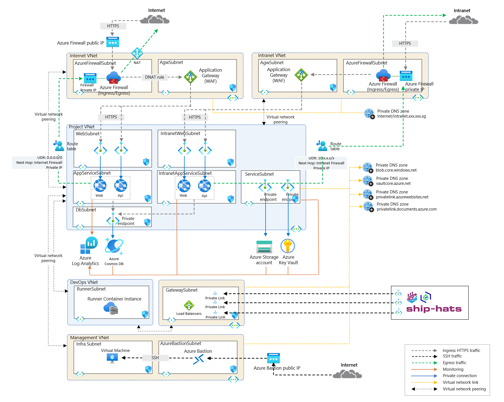

# App Service Archtetype Setup - Deployment Overview

This repository provides the configuration and infrastructure for an App Service archetype with enterprise-grade features, ensuring high availability, security, and scalability. The setup integrates with Microsoft Entra ID for authentication and authorization, supporting both internet and intranet workloads with isolated networking configurations.

---

## **Architecture Overview**

### **Components**

1. **Azure App Service Plan**  
   - Defines compute resources for running the app.  

2. **Web App / API App**  
   - Hosts applications with support for multiple runtimes like .NET, Node.js, Python, Java, and PHP.  

3. **Custom Domains and SSL**  
   - Provides secure communication through custom domain bindings and SSL certificates.  

4. **Networking Integration**  
   - Supports private endpoints and VNet integration for secure app connectivity.  

5. **Azure Key Vault**
   - Securely stores and manages cryptographic keys, secrets, and certificates, enhancing application security.

6. **Azure SQL Server**
   - A fully managed SQL database service with built-in high availability and disaster recovery.

7. **Azure Storage Account**
   - Provides scalable, secure, and durable cloud storage for blobs, files, queues, and tables.

8. **Azure Monitor**
   - Collects and visualizes metrics, logs, and traces for monitoring and troubleshooting.

9. **DevOps Integration**
    - Streamlines deployment with CI/CD pipelines using Azure DevOps or GitHub Actions.

---

## Key Features

### 1. **Networking configuration**  
   - **Private Endpoints**: Connect securely without exposing the app to the public internet.  
   - **VNet Integration**: Enables secure outbound calls from the app to other services within the Virtual Network. 

### 2. **Authentication and Authorization**
   - **Microsoft Entra ID Authentication**: Integrates with Microsoft Entra ID for user authentication.
   - **Kubernetes RBAC**: Enforces role-based access control (RBAC) for fine-grained access control.

### 3. **Container Insights**
   - Azure Monitor’s Container Insights provides monitoring, logging, and alerting for cluster and container-level metrics.

### 4. **Encryption**
   - **At-rest Encryption**: All data is encrypted at rest using Azure's platform-managed encryption keys for robust data protection.

### 5. **Diagnostic Settings**
   - Configured to capture logs and metrics for comprehensive monitoring and troubleshooting.

### 7. **Secrets Management**
   - Utilise Azure Key Vault for secure secrets management.

---

## **Requirements**

- **Terraform Version**: `>= 1.3.4`
- **AzureRM Provider**: `4.11.0` or later
- **AzAPI Provider**: `Azure/azapi`

This archetype can be deployed standalone or integrated into an Azure Landing Zone strategy, offering a flexible and secure foundation for an AKS Cluster on Azure.

