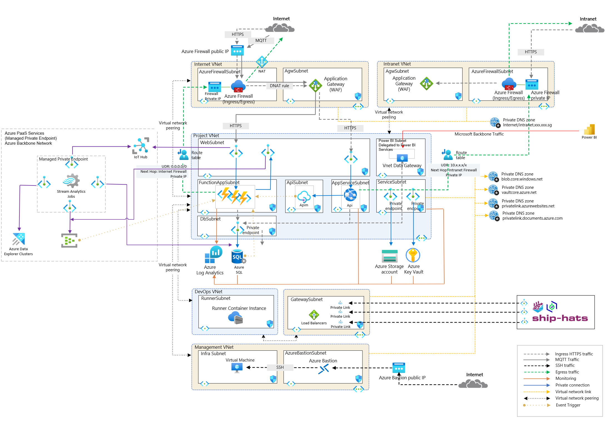

# IoT Archetype Setup - Deployment Overview

This repository provides the configuration and infrastructure for an IoT archetype with enterprise-grade features, ensuring high availability, security, and scalability. The setup integrates with Microsoft Entra ID for authentication and authorization, supporting data ingestion from IoT devices from the internet with isolated networking configurations.

---

## **Architecture Overview**

### **Components**

1. **IoT Hub**  
   - A managed service that enables secure and reliable bi-directional communication between IoT devices and the cloud.  
   - Supports device-to-cloud telemetry, file uploads, and cloud-to-device messaging with advanced security features.  

2. **Stream Analytics**  
   - A real-time analytics service designed for processing and analyzing large streams of data from IoT devices, sensors, applications, and other sources.  
   - Seamlessly integrates with Azure services like IoT Hub, Event Hubs, and Blob Storage for ingesting data.  

3. **Event Hub**  
   - A fully managed, real-time data ingestion service for large-scale streaming data.  
   - Designed for high-throughput event streaming, it supports integration with analytics services like Stream Analytics and Data Explorer.  

4. **Data Explorer**  
   - A fast and highly scalable data exploration service optimized for analyzing large volumes of log and telemetry data.  
   - Features a powerful KQL (Kusto Query Language) for quick and efficient data insights.  

5. **Azure Functions**  
   - A serverless compute service that allows you to run event-driven code without managing the underlying infrastructure.  
   - Supports various triggers like HTTP requests, timers, or data changes in Azure services.  

6. **API Management**  
   - A full-fledged service for managing, securing, and scaling APIs for internal and external consumption.  
   - Offers features like throttling, caching, security policies, and developer portal integration.  

7. **App Service**  
   - A managed platform for building, deploying, and scaling web apps, APIs, and backend services.  
   - Provides support for various programming languages and frameworks with built-in CI/CD capabilities.  

8. **Virtual Network**  
   - Provides secure and isolated networking for Azure resources, enabling them to communicate privately.  
   - Supports features like subnetting, NSGs (Network Security Groups), and VPN/ExpressRoute connectivity for hybrid setups.  

9. **Ingress Controller**  
   - Acts as a load balancer and routes external HTTP(S) traffic to Kubernetes services or microservices within the cluster.  
   - Supports SSL termination, URL path-based routing, and other advanced traffic management features.  

10. **Azure Key Vault**  
    - Securely stores sensitive information like passwords, API keys, and certificates to enhance application security.  
    - Supports integration with Azure services for seamless secrets and key management.  

11. **Azure SQL Server**  
    - A highly available and scalable relational database service with built-in automated backups, monitoring, and recovery.  
    - Provides robust features for security and performance optimization, including TDE (Transparent Data Encryption) and query performance insights.  

12. **Azure Storage Account**  
    - A versatile storage service offering Blob, File, Queue, and Table storage for a wide range of use cases.  
    - Ensures data redundancy and high availability with replication options like LRS (Locally Redundant Storage) and GRS (Geo-Redundant Storage).  
13. **Azure Monitor**  
    - Centralized monitoring service for gathering metrics, logs, and traces from Azure resources and applications.  
    - Offers advanced alerting, visualization, and integration with tools like Log Analytics and Application Insights.  

14. **DevOps Integration**  
    - Facilitates automated deployments and continuous delivery using Azure DevOps Pipelines or GitHub Actions.  
    - Ensures consistent workflows with infrastructure as code (IaC) practices using tools like Terraform or Bicep.  

--- 

## Key Features
### Integrated Iot Hub with Stream Analytics: 
- Azure IoT Hub integrates seamlessly with Azure Stream Analytics to process and analyze real-time telemetry data from IoT devices. The data ingested by IoT Hub can be routed to Stream Analytics for transformation, filtering, and aggregation, enabling actionable insights. Stream Analytics can further output processed data to Azure Data Explorer for advanced data exploration and visualization, supporting complex queries with KQL (Kusto Query Language). Additionally, Stream Analytic (or IoT Hub) can integrate with Azure Event Hub to handle large-scale streaming data, ensuring high throughput and reliability for scenarios such as real-time monitoring, predictive maintenance, and anomaly detection. Together, these services create a robust and scalable pipeline for IoT data processing and analysis.

### **Security and Compliance**
- Offers advanced network isolation, role-based access control (RBAC), and integration with Azure Key Vault to securely manage sensitive information.

### **Scalability and Performance**
- Engineered to support large-scale AKS microservices workloads with high performance, ensuring readiness for future growth.

### **Operational Efficiency**
- Simplifies deployment with predefined configurations and seamless integration with Azure services to optimize operations.

### **Networking and Identity Management**
- Facilitates efficient access control through streamlined deployment of networking and identity resources.

### **Azure Service Integration**
- Provides seamless compatibility with Azure services such as Azure Container Registry, Azure SQL Server, and Azure Storage Account, enhancing functionality and operational synergy.

### **Modular Deployment**
- Enables selective deployment of solution layers based on specific requirements, while considering interdependencies:
  - Full deployment ensures an end-to-end solution incorporating best practices like network isolation, managed identities, and RBAC.
  - Flexible configuration allows the exclusion of certain layers, such as the networking layer and individual azure resources, with options to customize the module as needed.
  - Supports deployment into existing Virtual Networks (VNETs) for seamless integration with Azure Landing Zones, enhancing adaptability to established infrastructures.

---

## **Requirements**

- **Terraform Version**: `>= 1.3.4`
- **AzureRM Provider**: `4.11.0` or later
- **AzAPI Provider**: `Azure/azapi`

This solution accelerator can be deployed standalone or integrated into an Azure Landing Zone strategy, offering a flexible and secure foundation for an IoT solution on Azure.

