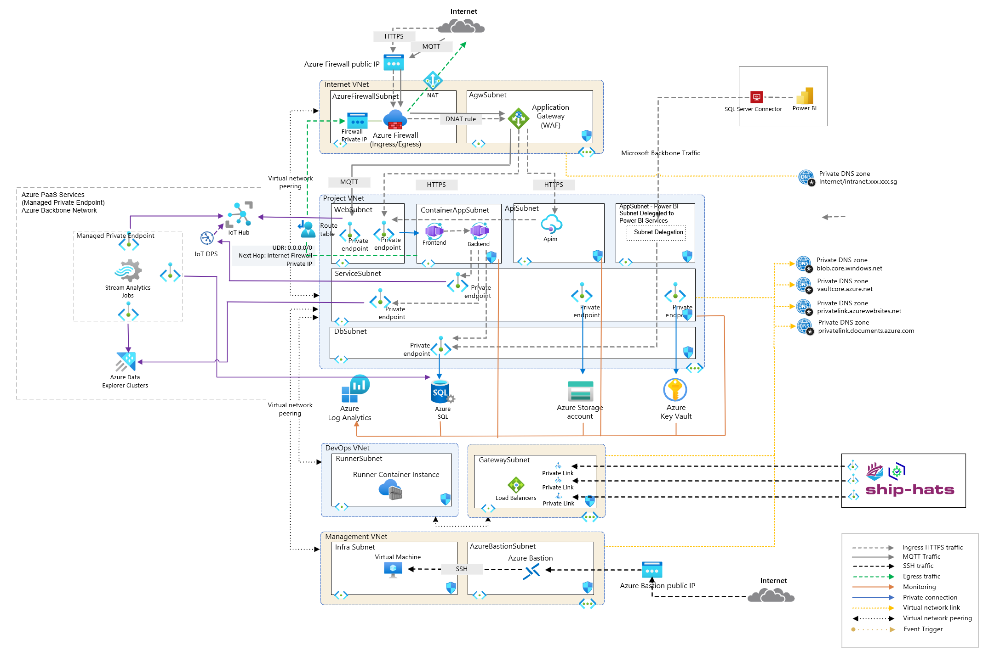

# IoT Setup - Deployment Overview

This repository provides the configuration and infrastructure for an IoT archetype with enterprise-grade features, ensuring high availability, security, and scalability. The setup integrates with Microsoft Entra ID for authentication and authorization, supporting both internet and intranet workloads with isolated networking configurations.

---

## **Architecture Overview**

### **Components**

---

## Key Features

---

## **Requirements**

- **Terraform Version**: `>= 1.3.4`
- **AzureRM Provider**: `4.11.0` or later
- **AzAPI Provider**: `Azure/azapi`

This solution accelerator can be deployed standalone or integrated into an Azure Landing Zone strategy, offering a flexible and secure foundation for an AKS Cluster on Azure.

